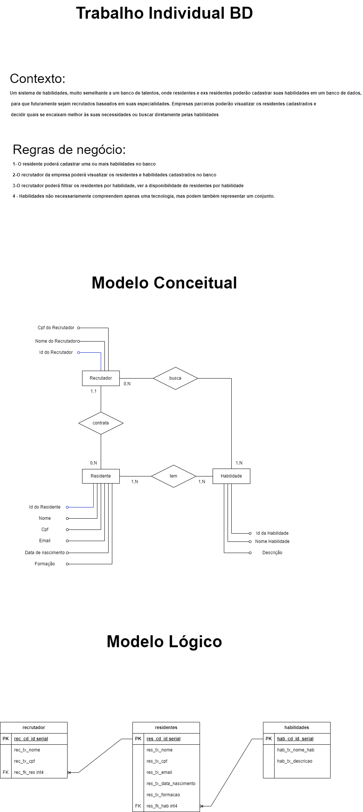

## :detective: Índice

<ul>
    <li>Sobre o Projeto</li>
    <li>Tecnologias utilizadas</li>
    <li>Diagrama</li>
    <li>Autores do Projeto</li>
</ul>

## :desktop_computer: Sobre o Projeto

$$ Sobre $$

Trabalho individual feito por Gabriel Pimentel na residência em TIC do Serratec.

## :hammer_and_wrench: Tecnologias utilizadas

- [DBeaver](https://dbeaver.io/download/)
- [PostgreSQL](https://www.postgresql.org)
- [Draw.io](https://app.diagrams.net/)
- [GitHub](https://github.com/)
- [Google Gemini](https://gemini.google.com/)

## :chart_with_upwards_trend: Diagramas

  ## Modelo Conceitual

## :fountain_pen: Autores

- 🥇  [Gabriel Pimentel](https://github.com/GabrielnPimentel)
- 🥈  Super Saiyan Beaver
- 🥉  Ordinary Beaver

  

